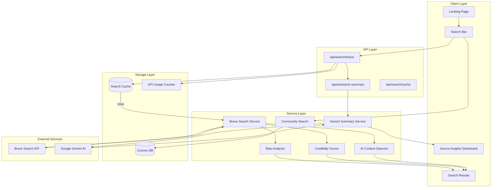

# Design Document: Aurora AI Search Engine

## Overview

Aurora AI Search Engine is a women-first search engine that combines Brave's privacy-focused web search with Aurora App's proprietary AI intelligence layer. The system provides web results enhanced with gender bias analysis, credibility scoring, AI content detection, and community-verified content integration.

The architecture prioritizes:
- **Zero-cost operation** using Brave's Free AI tier (2,000 requests/month)
- **Privacy-first** approach with no user tracking
- **Women-first perspective** in AI summaries and content analysis
- **Graceful degradation** when API limits are reached

## Architecture



## Components and Interfaces

### 1. Search API Route (`/api/search/brave`)

```typescript
interface BraveSearchRequest {
  query: string;
  count?: number; // default: 10
  offset?: number; // for pagination
  freshness?: 'day' | 'week' | 'month' | 'year';
}

interface BraveSearchResponse {
  results: SearchResult[];
  auroraInsights: AuroraInsights;
  cached: boolean;
  apiUsage: {
    used: number;
    limit: number;
    remaining: number;
  };
}
```

### 2. AI Summary Route (`/api/ai/search-summary`)

```typescript
interface SummaryRequest {
  query: string;
  results: SearchResult[];
}

interface SummaryResponse {
  summary: string;
  sources: string[];
  perspective: 'women-first' | 'balanced';
  generatedAt: string;
}
```

### 3. Bias Analyzer Service

```typescript
interface BiasAnalysis {
  genderBias: {
    score: number; // 0-100, higher = more women-positive
    label: 'Women-Positive' | 'Balanced' | 'Neutral' | 'Caution' | 'Potential Bias';
  };
  politicalBias: {
    indicator: 'Far Left' | 'Left' | 'Center-Left' | 'Center' | 'Center-Right' | 'Right' | 'Far Right';
    confidence: number;
  };
  commercialBias: {
    score: number; // 0-100
    hasAffiliateLinks: boolean;
    isSponsored: boolean;
  };
  emotionalTone: 'Factual' | 'Emotional' | 'Sensational' | 'Balanced';
}
```

### 4. Credibility Scorer Service

```typescript
interface CredibilityScore {
  score: number; // 0-100
  label: 'Highly Trusted' | 'Trusted' | 'Moderate' | 'Verify Source';
  factors: {
    domainType: 'gov' | 'edu' | 'news' | 'women-focused' | 'commercial' | 'unknown';
    isVerifiedNews: boolean;
    isWomenFocused: boolean;
    domainAge?: number;
  };
}
```

### 5. AI Content Detector Service

```typescript
interface AIContentDetection {
  percentage: number; // 0-100
  label: 'Mostly Human' | 'Some AI Content' | 'High AI Content';
  indicators: string[];
}
```

### 6. Landing Search Component

```typescript
interface LandingSearchProps {
  onSearch: (query: string) => void;
  suggestions: string[];
  trending: TrendingItem[];
  showMegaPaths: boolean;
}

interface TrendingItem {
  type: 'post' | 'route' | 'circle' | 'opportunity';
  title: string;
  icon: string;
}
```

## Data Models

### SearchResult

```typescript
interface SearchResult {
  id: string;
  title: string;
  url: string;
  description: string;
  favicon?: string;
  
  // Aurora Intelligence Layer
  biasAnalysis: BiasAnalysis;
  credibilityScore: CredibilityScore;
  aiContentDetection: AIContentDetection;
  safetyFlags: SafetyFlag[];
  
  // Metadata
  publishedDate?: string;
  domain: string;
  isWomenFocused: boolean;
}
```

### AuroraInsights

```typescript
interface AuroraInsights {
  averageGenderBias: number;
  averageCredibility: number;
  averageAIContent: number;
  politicalDistribution: Record<string, number>;
  womenFocusedCount: number;
  womenFocusedPercentage: number;
  recommendations: string[];
}
```

### SearchCache (Convex)

```typescript
// convex/schema.ts
searchCache: defineTable({
  queryHash: v.string(), // MD5 hash of normalized query
  query: v.string(),
  results: v.array(v.any()),
  auroraInsights: v.any(),
  cachedAt: v.number(),
  expiresAt: v.number(), // 24 hours from cachedAt
  hitCount: v.number(),
}).index("by_hash", ["queryHash"])
  .index("by_expiry", ["expiresAt"]),

// API Usage tracking
apiUsage: defineTable({
  month: v.string(), // "2024-12"
  used: v.number(),
  limit: v.number(), // 2000 for free tier
  lastUpdated: v.number(),
}).index("by_month", ["month"]),
```

### SafetyFlag

```typescript
type SafetyFlag = 
  | 'Verified Content'
  | 'Women-Led'
  | 'Safe Space'
  | 'Scam Warning'
  | 'Safety Concern'
  | 'Women-Focused';
```


## Correctness Properties

*A property is a characteristic or behavior that should hold true across all valid executions of a system-essentially, a formal statement about what the system should do. Properties serve as the bridge between human-readable specifications and machine-verifiable correctness guarantees.*

### Property 1: Query Validation
*For any* string input, if the string has fewer than 2 characters, the search should be rejected; if it has 2 or more characters, the search should proceed.
**Validates: Requirements 1.1**

### Property 2: Summary Length Constraint
*For any* AI-generated summary, the summary should contain at most 3 paragraphs and should include at least one source reference.
**Validates: Requirements 1.4**

### Property 3: Gender Bias Score Range
*For any* text content analyzed by the Bias_Analyzer, the gender bias score should be a number between 0 and 100 inclusive.
**Validates: Requirements 2.1**

### Property 4: Gender Bias Label Mapping
*For any* gender bias score, the label should be correctly mapped:
- 80-100: "Women-Positive"
- 60-79: "Balanced"
- 40-59: "Neutral"
- 20-39: "Caution"
- 0-19: "Potential Bias"
**Validates: Requirements 2.3**

### Property 5: Average Calculation Correctness
*For any* list of search results with bias/credibility/AI scores, the average displayed in Aurora Insights should equal the arithmetic mean of all individual scores.
**Validates: Requirements 2.4, 3.5, 4.4**

### Property 6: Political Bias Valid Categories
*For any* domain analyzed, the political bias indicator should be one of the valid categories: Far Left, Left, Center-Left, Center, Center-Right, Right, Far Right.
**Validates: Requirements 2B.1**

### Property 7: Credibility Score Range
*For any* URL/domain analyzed, the credibility score should be a number between 0 and 100 inclusive.
**Validates: Requirements 3.1**

### Property 8: Domain Type Credibility Ordering
*For any* two domains where one is .gov/.edu and the other is unknown, the .gov/.edu domain should have a higher base credibility score.
**Validates: Requirements 3.2**

### Property 9: Women-Focused Domain Bonus
*For any* domain in the known women-focused list (unwomen.org, catalyst.org, etc.), the credibility score should include a bonus of at least 10 points.
**Validates: Requirements 3.3**

### Property 10: Credibility Label Mapping
*For any* credibility score, the label should be correctly mapped:
- 80-100: "Highly Trusted"
- 60-79: "Trusted"
- 40-59: "Moderate"
- 0-39: "Verify Source"
**Validates: Requirements 3.4**

### Property 11: AI Content Detection Range
*For any* text analyzed, the AI content percentage should be a number between 0 and 100 inclusive.
**Validates: Requirements 4.1**

### Property 12: AI Content Color Coding
*For any* AI content percentage:
- 0-30%: green indicator
- 31-60%: yellow indicator
- 61-100%: red indicator
**Validates: Requirements 4.3**

### Property 13: Cache Round Trip
*For any* search query, if the query is executed and then immediately executed again, the second execution should return cached results (cached: true) without making a new API call.
**Validates: Requirements 12.1, 12.2**

### Property 14: Ad Placement Position
*For any* list of web search results displayed to a non-Premium user, a native ad should appear after the 3rd result (at index 3).
**Validates: Requirements 10.1**

### Property 15: Premium Ad Removal
*For any* Premium user viewing search results, no ads should be displayed in the results.
**Validates: Requirements 10.4**

### Property 16: API Usage Counter Increment
*For any* non-cached search that calls the Brave API, the API usage counter should increment by exactly 1.
**Validates: Requirements 12.6**

## Error Handling

### API Failures

| Error Type | Handling Strategy |
|------------|-------------------|
| Brave API timeout | Return cached results if available, otherwise community-only results |
| Brave API rate limit | Gracefully degrade to community search with user notification |
| Gemini API failure | Display results without AI summary, show "Summary unavailable" |
| Invalid query | Return validation error with helpful message |
| Network error | Show offline indicator, use cached data if available |

### Graceful Degradation Hierarchy

1. **Full functionality**: Brave API + Gemini AI + Community Search
2. **Limited web**: Cached Brave results + Gemini AI + Community Search
3. **Community only**: Community Search only (when API limit reached)
4. **Offline mode**: Cached results only

### Error Response Format

```typescript
interface SearchError {
  code: 'INVALID_QUERY' | 'API_LIMIT' | 'API_ERROR' | 'NETWORK_ERROR';
  message: string;
  fallback: 'cached' | 'community' | 'none';
  retryAfter?: number; // seconds
}
```

## Testing Strategy

### Dual Testing Approach

This feature requires both unit tests and property-based tests:
- **Unit tests**: Verify specific examples, edge cases, and integration points
- **Property-based tests**: Verify universal properties that should hold across all inputs

### Property-Based Testing Library

**Library**: fast-check (TypeScript/JavaScript)
**Configuration**: Minimum 100 iterations per property test

### Test Categories

#### 1. Bias Analyzer Tests
- Property tests for score range validation (0-100)
- Property tests for label mapping correctness
- Unit tests for specific keyword detection
- Edge cases: empty text, very long text, non-English text

#### 2. Credibility Scorer Tests
- Property tests for score range validation
- Property tests for domain type ordering
- Unit tests for known domains (gov, edu, women-focused)
- Edge cases: malformed URLs, unknown TLDs

#### 3. AI Content Detector Tests
- Property tests for percentage range validation
- Property tests for color coding mapping
- Unit tests for known AI patterns
- Edge cases: very short text, code snippets

#### 4. Cache System Tests
- Property tests for cache round-trip
- Unit tests for cache expiration (24 hours)
- Unit tests for cache invalidation
- Edge cases: concurrent requests, cache overflow

#### 5. API Usage Tests
- Property tests for counter increment
- Unit tests for rate limiting logic
- Unit tests for monthly reset
- Edge cases: month boundary, concurrent increments

### Test File Structure

```
aurora-app/
├── lib/
│   ├── search/
│   │   ├── bias-analyzer.ts
│   │   ├── bias-analyzer.test.ts
│   │   ├── bias-analyzer.property.test.ts
│   │   ├── credibility-scorer.ts
│   │   ├── credibility-scorer.test.ts
│   │   ├── credibility-scorer.property.test.ts
│   │   ├── ai-detector.ts
│   │   ├── ai-detector.test.ts
│   │   └── ai-detector.property.test.ts
│   └── cache/
│       ├── search-cache.ts
│       └── search-cache.test.ts
└── convex/
    └── tests/
        └── search.property.test.ts
```

### Property Test Annotation Format

Each property-based test must include a comment referencing the design document:

```typescript
/**
 * **Feature: aurora-ai-search-engine, Property 3: Gender Bias Score Range**
 * For any text content, the gender bias score should be between 0 and 100.
 */
```
