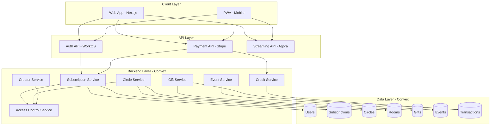
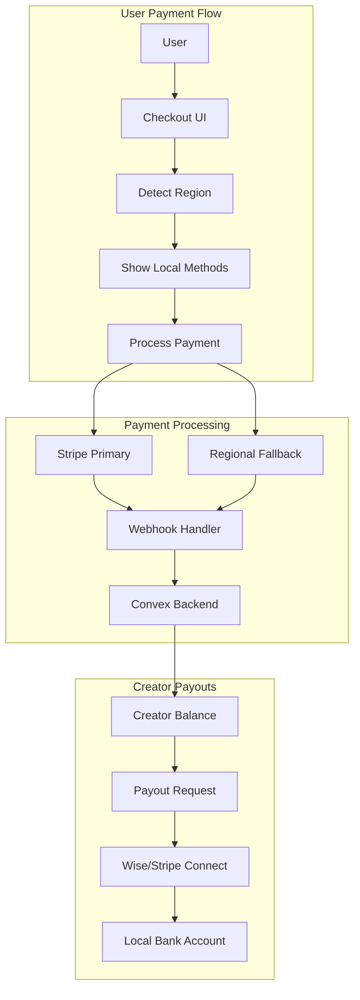

# Aurora Premium Expansion - Design Document

## Overview

The Aurora Premium Expansion transforms Aurora App from a single-tier subscription model into a comprehensive monetization ecosystem with multiple revenue streams. The design prioritizes:

1. **Mission Alignment**: Safety features remain free for all users
2. **Community Empowerment**: Circle hosts and creators can monetize their communities
3. **Scalable Architecture**: Support for millions of users with real-time features
4. **Fair Economics**: Transparent fee structures that reward engagement

The system builds on existing Convex infrastructure, extending the schema and adding new backend functions for subscription management, payments, and access control.

## Architecture



## Components and Interfaces

### 1. Subscription Service

Manages user subscriptions across all tiers.

```typescript
interface SubscriptionTier {
  id: "free" | "plus" | "pro" | "elite";
  name: string;
  monthlyPrice: number;
  annualPrice: number; // 20% discount
  benefits: TierBenefits;
}

interface TierBenefits {
  adFree: boolean;
  aiMessagesPerDay: number; // -1 for unlimited
  postsPerHour: number;
  reelsPerDay: number;
  livestreamsPerDay: number;
  monthlyCredits: number;
  prioritySupport: boolean;
  advancedAnalytics: boolean;
  exclusiveEvents: boolean;
  safetyConsultations: boolean;
  badge: "none" | "premium" | "pro" | "vip";
}

interface UserSubscription {
  userId: Id<"users">;
  tier: SubscriptionTier["id"];
  billingCycle: "monthly" | "annual";
  stripeSubscriptionId: string;
  currentPeriodStart: number;
  currentPeriodEnd: number;
  status: "active" | "cancelled" | "past_due";
}

// Convex Functions
const subscriptionService = {
  // Queries
  getUserSubscription: (userId: Id<"users">) => UserSubscription | null,
  getTierBenefits: (tier: string) => TierBenefits,
  getAllTiers: () => SubscriptionTier[],
  
  // Mutations
  createSubscription: (userId: Id<"users">, tier: string, billingCycle: string) => void,
  updateSubscription: (userId: Id<"users">, newTier: string) => void,
  cancelSubscription: (userId: Id<"users">) => void,
  handleStripeWebhook: (event: StripeEvent) => void,
};
```

### 2. Circle Premium Service

Enables Circle monetization with membership tiers.

```typescript
interface CircleTier {
  id: string;
  circleId: Id<"circles">;
  name: string;
  price: number; // monthly in credits or USD
  benefits: string[];
  roomAccess: Id<"rooms">[];
}

interface CircleMembership {
  circleId: Id<"circles">;
  userId: Id<"users">;
  tier: "free" | "supporter" | "vip";
  subscribedAt: number;
  renewsAt: number;
}

interface CircleRevenue {
  circleId: Id<"circles">;
  totalSubscribers: number;
  monthlyRevenue: number;
  platformFee: number; // 20% or 15% for 100+ members
  hostEarnings: number;
}

// Convex Functions
const circlePremiumService = {
  // Queries
  getCircleTiers: (circleId: Id<"circles">) => CircleTier[],
  getMembership: (circleId: Id<"circles">, userId: Id<"users">) => CircleMembership,
  getCircleRevenue: (circleId: Id<"circles">) => CircleRevenue,
  
  // Mutations
  enablePremium: (circleId: Id<"circles">, tiers: CircleTier[]) => void,
  subscribeTier: (circleId: Id<"circles">, userId: Id<"users">, tier: string) => void,
  createTierRoom: (circleId: Id<"circles">, roomType: RoomType, tier: string) => Id<"rooms">,
};
```

### 3. Room Service

Manages different room types within Circles.

```typescript
type RoomType = "chat" | "audio" | "video" | "forum" | "broadcast";

interface Room {
  _id: Id<"rooms">;
  circleId: Id<"circles">;
  name: string;
  type: RoomType;
  visibility: "public" | "members" | "tier";
  requiredTier?: string;
  maxParticipants?: number; // 16 for video, 9 hosts for broadcast
  createdBy: Id<"users">;
  isActive: boolean;
}

interface ChatRoom extends Room {
  type: "chat";
  features: {
    threads: boolean;
    reactions: boolean;
    gifs: boolean;
    polls: boolean;
    pins: boolean;
    mentions: boolean;
  };
}

interface AudioRoom extends Room {
  type: "audio";
  currentSpeakers: Id<"users">[];
  listeners: Id<"users">[];
}

interface VideoRoom extends Room {
  type: "video";
  maxParticipants: 16;
  currentParticipants: Id<"users">[];
  agoraChannel: string;
}

interface BroadcastRoom extends Room {
  type: "broadcast";
  maxHosts: 9;
  hosts: Id<"users">[];
  viewers: Id<"users">[];
  agoraChannel: string;
}
```

### 4. Gift Service

Handles virtual gifts and tipping.

```typescript
interface GiftCategory {
  id: string;
  name: string;
  minCredits: number;
  maxCredits: number;
  gifts: Gift[];
}

interface Gift {
  id: string;
  name: string;
  credits: number;
  animationUrl: string;
  category: string;
}

interface GiftTransaction {
  _id: Id<"giftTransactions">;
  fromUserId: Id<"users">;
  toUserId: Id<"users">;
  giftId: string;
  credits: number;
  livestreamId?: Id<"livestreams">;
  message?: string;
  createdAt: number;
}

interface SuperChat {
  _id: Id<"superChats">;
  userId: Id<"users">;
  livestreamId: Id<"livestreams">;
  message: string;
  credits: number;
  pinnedUntil: number; // timestamp
}

// Revenue split: 85% to creator, 15% platform
const GIFT_CREATOR_SHARE = 0.85;

// Convex Functions
const giftService = {
  // Queries
  getGiftCategories: () => GiftCategory[],
  getCreatorGifts: (creatorId: Id<"users">) => GiftTransaction[],
  getGiftLeaderboard: (creatorId: Id<"users">) => LeaderboardEntry[],
  
  // Mutations
  sendGift: (fromUserId: Id<"users">, toUserId: Id<"users">, giftId: string, livestreamId?: Id<"livestreams">) => void,
  sendSuperChat: (userId: Id<"users">, livestreamId: Id<"livestreams">, message: string, credits: number) => void,
};
```

### 5. Event Service

Manages paid and free events.

```typescript
interface Event {
  _id: Id<"events">;
  circleId?: Id<"circles">;
  hostId: Id<"users">;
  title: string;
  description: string;
  type: "virtual" | "in-person" | "hybrid";
  pricing: "free" | "paid" | "tier-exclusive";
  price?: number; // in credits or USD
  requiredTier?: string;
  capacity: number;
  waitlistEnabled: boolean;
  startTime: number;
  endTime: number;
  location?: {
    name: string;
    address?: string;
    coordinates?: [number, number];
  };
  roomId?: Id<"rooms">; // for virtual events
  status: "upcoming" | "live" | "ended" | "cancelled";
}

interface EventRSVP {
  eventId: Id<"events">;
  userId: Id<"users">;
  status: "going" | "maybe" | "waitlist";
  paidAmount?: number;
  rsvpedAt: number;
}

interface EventReview {
  eventId: Id<"events">;
  userId: Id<"users">;
  rating: 1 | 2 | 3 | 4 | 5;
  review?: string;
  createdAt: number;
}

// Revenue split: 80% to host, 20% platform
const EVENT_HOST_SHARE = 0.80;
```

### 6. Credit Service

Manages credit purchases and rewards.

```typescript
interface CreditPackage {
  id: string;
  credits: number;
  priceUSD: number;
  bonus?: number; // bonus credits for larger packages
}

interface CreditReward {
  action: string;
  credits: number;
  cooldown?: number; // milliseconds between rewards
}

const CREDIT_PACKAGES: CreditPackage[] = [
  { id: "small", credits: 100, priceUSD: 1 },
  { id: "medium", credits: 500, priceUSD: 4 },
  { id: "large", credits: 1000, priceUSD: 7 },
  { id: "xl", credits: 5000, priceUSD: 30, bonus: 500 },
];

const CREDIT_REWARDS: CreditReward[] = [
  { action: "daily_login", credits: 5, cooldown: 86400000 },
  { action: "post_created", credits: 10 },
  { action: "safety_verification", credits: 25 },
  { action: "checkin_completed", credits: 15 },
  { action: "referral_success", credits: 100 },
];

// Convex Functions
const creditService = {
  // Queries
  getCreditPackages: () => CreditPackage[],
  getCreditHistory: (userId: Id<"users">) => Transaction[],
  getCreditBalance: (userId: Id<"users">) => number,
  
  // Mutations
  purchaseCredits: (userId: Id<"users">, packageId: string) => void,
  awardCredits: (userId: Id<"users">, action: string, relatedId?: string) => void,
  spendCredits: (userId: Id<"users">, amount: number, reason: string) => void,
};
```

### 7. Access Control Service

Centralized access control for premium features.

```typescript
interface AccessCheck {
  userId: Id<"users">;
  resource: string;
  resourceId?: string;
}

interface AccessResult {
  allowed: boolean;
  reason?: string;
  requiredTier?: string;
  upgradeUrl?: string;
}

// Convex Functions
const accessControlService = {
  // Queries
  checkAccess: (check: AccessCheck) => AccessResult,
  getUserLimits: (userId: Id<"users">) => UserLimits,
  
  // Safety features are ALWAYS accessible
  isSafetyFeature: (resource: string) => boolean,
};

// Safety features that are NEVER gated
const SAFETY_FEATURES = [
  "panic_button",
  "emergency_contacts",
  "safety_checkins",
  "basic_routes",
  "safety_resources",
  "emergency_mode",
];
```

## Data Models

### Extended Schema (Convex)

```typescript
// New tables to add to schema.ts

// Subscription tiers configuration
subscriptionTiers: defineTable({
  id: v.string(),
  name: v.string(),
  monthlyPrice: v.number(),
  annualPrice: v.number(),
  benefits: v.object({
    adFree: v.boolean(),
    aiMessagesPerDay: v.number(),
    postsPerHour: v.number(),
    reelsPerDay: v.number(),
    livestreamsPerDay: v.number(),
    monthlyCredits: v.number(),
    prioritySupport: v.boolean(),
    advancedAnalytics: v.boolean(),
    exclusiveEvents: v.boolean(),
    safetyConsultations: v.boolean(),
    badge: v.string(),
  }),
}).index("by_id", ["id"]),

// User subscriptions
userSubscriptions: defineTable({
  userId: v.id("users"),
  tier: v.string(),
  billingCycle: v.union(v.literal("monthly"), v.literal("annual")),
  stripeSubscriptionId: v.optional(v.string()),
  currentPeriodStart: v.number(),
  currentPeriodEnd: v.number(),
  status: v.union(v.literal("active"), v.literal("cancelled"), v.literal("past_due")),
})
  .index("by_user", ["userId"])
  .index("by_stripe_id", ["stripeSubscriptionId"]),

// Circle premium tiers
circleTiers: defineTable({
  circleId: v.id("circles"),
  tierId: v.string(),
  name: v.string(),
  price: v.number(),
  benefits: v.array(v.string()),
  roomAccess: v.array(v.id("rooms")),
})
  .index("by_circle", ["circleId"]),

// Circle memberships (premium)
circleMemberships: defineTable({
  circleId: v.id("circles"),
  userId: v.id("users"),
  tier: v.string(),
  subscribedAt: v.number(),
  renewsAt: v.number(),
  status: v.union(v.literal("active"), v.literal("cancelled")),
})
  .index("by_circle", ["circleId"])
  .index("by_user", ["userId"])
  .index("by_circle_user", ["circleId", "userId"]),

// Rooms (for Circles)
rooms: defineTable({
  circleId: v.id("circles"),
  name: v.string(),
  type: v.union(
    v.literal("chat"),
    v.literal("audio"),
    v.literal("video"),
    v.literal("forum"),
    v.literal("broadcast")
  ),
  visibility: v.union(v.literal("public"), v.literal("members"), v.literal("tier")),
  requiredTier: v.optional(v.string()),
  maxParticipants: v.optional(v.number()),
  createdBy: v.id("users"),
  isActive: v.boolean(),
  agoraChannel: v.optional(v.string()),
})
  .index("by_circle", ["circleId"])
  .index("by_type", ["type"]),

// Gift transactions
giftTransactions: defineTable({
  fromUserId: v.id("users"),
  toUserId: v.id("users"),
  giftId: v.string(),
  credits: v.number(),
  livestreamId: v.optional(v.id("livestreams")),
  message: v.optional(v.string()),
})
  .index("by_recipient", ["toUserId"])
  .index("by_sender", ["fromUserId"])
  .index("by_livestream", ["livestreamId"]),

// Super chats
superChats: defineTable({
  userId: v.id("users"),
  livestreamId: v.id("livestreams"),
  message: v.string(),
  credits: v.number(),
  pinnedUntil: v.number(),
})
  .index("by_livestream", ["livestreamId"]),

// Events
events: defineTable({
  circleId: v.optional(v.id("circles")),
  hostId: v.id("users"),
  title: v.string(),
  description: v.string(),
  type: v.union(v.literal("virtual"), v.literal("in-person"), v.literal("hybrid")),
  pricing: v.union(v.literal("free"), v.literal("paid"), v.literal("tier-exclusive")),
  price: v.optional(v.number()),
  requiredTier: v.optional(v.string()),
  capacity: v.number(),
  waitlistEnabled: v.boolean(),
  startTime: v.number(),
  endTime: v.number(),
  location: v.optional(v.object({
    name: v.string(),
    address: v.optional(v.string()),
    coordinates: v.optional(v.array(v.number())),
  })),
  roomId: v.optional(v.id("rooms")),
  status: v.union(
    v.literal("upcoming"),
    v.literal("live"),
    v.literal("ended"),
    v.literal("cancelled")
  ),
})
  .index("by_circle", ["circleId"])
  .index("by_host", ["hostId"])
  .index("by_status", ["status"])
  .index("by_start_time", ["startTime"]),

// Event RSVPs
eventRsvps: defineTable({
  eventId: v.id("events"),
  userId: v.id("users"),
  status: v.union(v.literal("going"), v.literal("maybe"), v.literal("waitlist")),
  paidAmount: v.optional(v.number()),
})
  .index("by_event", ["eventId"])
  .index("by_user", ["userId"])
  .index("by_event_user", ["eventId", "userId"]),

// Event reviews
eventReviews: defineTable({
  eventId: v.id("events"),
  userId: v.id("users"),
  rating: v.number(),
  review: v.optional(v.string()),
})
  .index("by_event", ["eventId"]),

// Credit packages (configuration)
creditPackages: defineTable({
  packageId: v.string(),
  credits: v.number(),
  priceUSD: v.number(),
  bonus: v.optional(v.number()),
}).index("by_package_id", ["packageId"]),

// Referrals
referrals: defineTable({
  referrerId: v.id("users"),
  refereeId: v.id("users"),
  status: v.union(v.literal("pending"), v.literal("completed")),
  creditAwarded: v.boolean(),
})
  .index("by_referrer", ["referrerId"])
  .index("by_referee", ["refereeId"]),
```

## Correctness Properties

*A property is a characteristic or behavior that should hold true across all valid executions of a system-essentially, a formal statement about what the system should do. Properties serve as the bridge between human-readable specifications and machine-verifiable correctness guarantees.*

Based on the prework analysis and property reflection, the following correctness properties have been identified:

### Property 1: Tier Benefits Inheritance
*For any* subscription tier, the user receives exactly the benefits defined for that tier, and higher tiers include all benefits from lower tiers (Plus ⊂ Pro ⊂ Elite).

**Validates: Requirements 1.2, 1.3, 1.4**

### Property 2: Annual Billing Discount
*For any* subscription tier, the annual price equals the monthly price multiplied by 12 and then multiplied by 0.8 (20% discount).

**Validates: Requirements 1.6**

### Property 3: Tier Upgrade/Downgrade Proration
*For any* tier change, the proration amount equals the difference in tier prices multiplied by the remaining days in the billing period divided by total days.

**Validates: Requirements 1.5**

### Property 4: Tier-Restricted Access Control
*For any* tier-restricted resource (room, content, event), access is granted if and only if the user's subscription tier or Circle membership tier meets or exceeds the required tier.

**Validates: Requirements 2.2, 6.2**

### Property 5: Platform Fee Reduction Threshold
*For any* Circle with 100+ paying members, the platform fee is 15%; otherwise it is 20%. For any creator with 1000+ subscribers, the platform fee is 10%; otherwise it is 15%.

**Validates: Requirements 2.5, 6.4**

### Property 6: Revenue Share Calculation
*For any* gift transaction, the creator receives exactly 85% of the credit value. For any paid event, the host receives exactly 80% of the ticket price.

**Validates: Requirements 4.3, 5.3**

### Property 7: Gift Leaderboard Ordering
*For any* creator's gift leaderboard, supporters are ordered by total credits gifted in descending order.

**Validates: Requirements 4.4**

### Property 8: Super Chat Pinning Duration
*For any* Super Chat of 50+ credits, the message is pinned for exactly 60 seconds from the time of sending.

**Validates: Requirements 4.5**

### Property 9: Video Room Participant Limit
*For any* video room, the number of participants never exceeds 16.

**Validates: Requirements 3.3**

### Property 10: Broadcast Room Host Limit
*For any* broadcast room, the number of hosts never exceeds 9.

**Validates: Requirements 3.5**

### Property 11: Event Calendar Aggregation
*For any* user, the event calendar contains all upcoming events from all Circles the user has joined.

**Validates: Requirements 5.6**

### Property 12: Credit Purchase Accuracy
*For any* credit purchase, the user's balance increases by exactly the package amount plus any bonus credits.

**Validates: Requirements 9.2**

### Property 13: Engagement Credit Awards
*For any* engagement action (login, post, verification, check-in), the correct credit amount is awarded according to the reward schedule.

**Validates: Requirements 9.3**

### Property 14: Referral Credit Distribution
*For any* successful referral, both the referrer and referee receive exactly 100 credits.

**Validates: Requirements 9.4**

### Property 15: Credit History Completeness
*For any* user, the credit history contains all transactions (earnings, purchases, spending) with no missing entries.

**Validates: Requirements 9.5**

### Property 16: Free Tier Safety Access
*For any* user (including free tier), all safety-critical features (panic button, emergency contacts, safety check-ins, basic routes, emergency mode) are fully accessible without payment.

**Validates: Requirements 10.1, 10.4, 10.6**

### Property 17: Free Tier Basic Access
*For any* free user, access to public Circles and 10 AI messages per day is available.

**Validates: Requirements 10.2, 10.3**

## Global Payment Strategy

For Aurora App to become the next big tech platform serving women globally, we need a multi-layered payment approach:

### Primary Payment Processor: Stripe

**Why Stripe:**
- Available in 46+ countries with local payment methods
- Handles currency conversion automatically
- PCI compliant, reducing security burden
- Excellent developer experience with Convex integration
- Supports subscriptions, one-time payments, and payouts

### Regional Payment Methods (via Stripe)

```typescript
interface PaymentMethods {
  // Americas
  northAmerica: ["card", "apple_pay", "google_pay", "cash_app"],
  latinAmerica: ["card", "oxxo", "boleto", "pix", "mercado_pago"],
  
  // Europe
  europe: ["card", "sepa_debit", "ideal", "bancontact", "giropay", "klarna"],
  uk: ["card", "bacs_debit", "apple_pay", "google_pay"],
  
  // Asia Pacific
  india: ["card", "upi", "netbanking", "wallets"],
  southeastAsia: ["card", "grabpay", "paynow", "fpx", "gcash"],
  japan: ["card", "konbini", "paypay"],
  
  // Middle East & Africa
  mena: ["card", "mada", "stc_pay"],
  africa: ["card", "mpesa", "flutterwave"],
}
```

### Pricing Strategy: Purchasing Power Parity (PPP)

To make Aurora App accessible globally, implement regional pricing:

```typescript
interface RegionalPricing {
  tier: string;
  baseUSD: number;
  regions: {
    [region: string]: {
      currency: string;
      price: number;
      pppMultiplier: number;
    };
  };
}

const AURORA_PLUS_PRICING: RegionalPricing = {
  tier: "plus",
  baseUSD: 5,
  regions: {
    US: { currency: "USD", price: 5, pppMultiplier: 1.0 },
    EU: { currency: "EUR", price: 4.50, pppMultiplier: 0.9 },
    UK: { currency: "GBP", price: 4, pppMultiplier: 0.8 },
    IN: { currency: "INR", price: 149, pppMultiplier: 0.3 }, // ~$1.80
    BR: { currency: "BRL", price: 15, pppMultiplier: 0.6 },
    MX: { currency: "MXN", price: 50, pppMultiplier: 0.6 },
    NG: { currency: "NGN", price: 1500, pppMultiplier: 0.3 },
    PH: { currency: "PHP", price: 150, pppMultiplier: 0.5 },
    ID: { currency: "IDR", price: 35000, pppMultiplier: 0.4 },
  },
};
```

### Credit System as Universal Currency

The credit system solves cross-border payment complexity:

```typescript
// Credits are priced regionally but have universal value
const CREDIT_REGIONAL_PRICING = {
  "100_credits": {
    US: { currency: "USD", price: 1.00 },
    IN: { currency: "INR", price: 29 },  // ~$0.35
    BR: { currency: "BRL", price: 3 },   // ~$0.60
    NG: { currency: "NGN", price: 300 }, // ~$0.35
  },
};

// Benefits:
// 1. Users in lower-income regions can afford credits
// 2. Creators receive fair value regardless of supporter location
// 3. Platform handles currency complexity
```

### Alternative Payment Providers (Fallback)

For regions where Stripe has limitations:

```typescript
interface PaymentProviders {
  primary: "stripe",
  fallbacks: {
    india: "razorpay",      // Better UPI integration
    africa: "flutterwave",  // M-Pesa, local banks
    latam: "mercadopago",   // Regional leader
    sea: "xendit",          // GrabPay, GCash, etc.
  },
}
```

### Creator Payouts Strategy

```typescript
interface PayoutOptions {
  // Instant payouts (where available)
  instant: {
    stripe_instant: ["US", "UK", "EU", "CA", "AU"],
    wise: ["global"], // 80+ countries
  },
  
  // Standard payouts (2-5 business days)
  standard: {
    bank_transfer: ["global"],
    paypal: ["global"],
  },
  
  // Crypto payouts (optional, for unbanked regions)
  crypto: {
    usdc: ["global"], // Stablecoin option
  },
  
  // Minimum payout thresholds (regional)
  minimums: {
    US: 10,   // USD
    IN: 500,  // INR (~$6)
    NG: 5000, // NGN (~$6)
  },
}
```

### Implementation Architecture



### Fraud Prevention

```typescript
interface FraudPrevention {
  // Stripe Radar for card fraud
  stripeRadar: true,
  
  // Regional risk rules
  rules: [
    "block_vpn_mismatched_country",
    "require_3ds_high_risk",
    "limit_new_accounts_first_week",
  ],
  
  // Credit purchase limits
  limits: {
    newUser: { daily: 100, weekly: 500 },
    verified: { daily: 1000, weekly: 5000 },
    premium: { daily: 5000, weekly: 20000 },
  },
}
```

### Recommended Implementation Order

1. **Phase 1**: Stripe for US, UK, EU, CA, AU (covers ~60% of paying users)
2. **Phase 2**: Add regional payment methods via Stripe (India UPI, Brazil PIX, etc.)
3. **Phase 3**: Integrate Wise for global creator payouts
4. **Phase 4**: Add regional fallback providers for underserved markets
5. **Phase 5**: Consider crypto payouts for unbanked creators

## Error Handling

### Payment Failures
- Stripe webhook failures trigger retry with exponential backoff
- Failed subscription payments move user to "past_due" status with 7-day grace period
- Credit purchase failures are logged and user is notified immediately

### Access Control Errors
- Unauthorized access attempts are logged for security monitoring
- Users receive clear error messages with upgrade paths
- Safety features NEVER return access denied errors

### Rate Limiting
- API rate limits prevent abuse (100 requests/minute per user)
- Credit earning has cooldowns to prevent gaming
- Gift sending has per-minute limits to prevent spam

### Data Consistency
- All financial transactions use Convex's ACID guarantees
- Credit balance changes are atomic operations
- Subscription status changes are logged in transactions table

## Testing Strategy

### Dual Testing Approach

The testing strategy employs both unit tests and property-based tests:

1. **Unit Tests**: Verify specific examples, edge cases, and integration points
2. **Property-Based Tests**: Verify universal properties hold across all valid inputs

### Property-Based Testing Framework

**Framework**: fast-check (TypeScript)

Each property-based test will:
- Run a minimum of 100 iterations
- Use smart generators that constrain to valid input spaces
- Be tagged with the correctness property it implements

### Test Categories

#### Subscription Tests
- Unit: Verify tier configuration is correct
- Property: Tier benefits inheritance (Property 1)
- Property: Annual discount calculation (Property 2)
- Property: Proration calculation (Property 3)

#### Access Control Tests
- Unit: Verify specific access scenarios
- Property: Tier-restricted access (Property 4)
- Property: Safety feature access (Property 16)
- Property: Free tier access (Property 17)

#### Financial Tests
- Unit: Verify specific transaction amounts
- Property: Revenue share calculation (Property 6)
- Property: Credit purchase accuracy (Property 12)
- Property: Referral credits (Property 14)

#### Room Tests
- Property: Video room limit (Property 9)
- Property: Broadcast host limit (Property 10)

#### Leaderboard Tests
- Property: Gift leaderboard ordering (Property 7)

### Test File Structure

```
aurora-app/
├── __tests__/
│   ├── premium/
│   │   ├── subscription.test.ts
│   │   ├── subscription.property.test.ts
│   │   ├── access-control.test.ts
│   │   ├── access-control.property.test.ts
│   │   └── credits.property.test.ts
│   ├── circles/
│   │   ├── rooms.property.test.ts
│   │   └── membership.property.test.ts
│   ├── gifts/
│   │   ├── transactions.property.test.ts
│   │   └── leaderboard.property.test.ts
│   └── events/
│       └── calendar.property.test.ts
```

### Property Test Example Format

```typescript
import fc from 'fast-check';

/**
 * Feature: aurora-premium-expansion, Property 6: Revenue Share Calculation
 * Validates: Requirements 4.3, 5.3
 */
describe('Revenue Share Calculation', () => {
  it('creator receives exactly 85% of gift value', () => {
    fc.assert(
      fc.property(
        fc.integer({ min: 1, max: 10000 }), // gift amount
        (giftAmount) => {
          const creatorShare = calculateCreatorShare(giftAmount, 'gift');
          return creatorShare === Math.floor(giftAmount * 0.85);
        }
      ),
      { numRuns: 100 }
    );
  });
});
```
