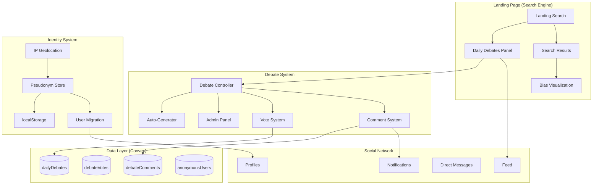

# Design Document: Aurora App UX Excellence Initiative

## Overview

This design transforms Aurora App into a world-class women-first search engine with integrated community features. The core innovation is the **Daily Debates System** - 6 categorized debates per day that bridge the search engine and social network, creating a virtuous engagement loop. Combined with enhanced bias visualization, complete internationalization, and performance optimizations, this positions Aurora App as a unique competitor to Google, Brave, and Bing.

## Architecture



## Components and Interfaces

### 1. Daily Debates System

```typescript
// Database Schema Addition
dailyDebates: defineTable({
  date: v.string(), // "2024-12-06"
  slot: v.number(), // 1-6
  category: v.union(
    v.literal("safety"),
    v.literal("career"),
    v.literal("health"),
    v.literal("rights"),
    v.literal("tech"),
    v.literal("world")
  ),
  title: v.string(),
  sourceUrl: v.string(),
  sourceName: v.string(),
  imageUrl: v.optional(v.string()),
  summary: v.string(),
  // Vote counts (denormalized)
  agreeCount: v.number(),
  disagreeCount: v.number(),
  neutralCount: v.number(),
  commentCount: v.number(),
  // Source
  isAutoGenerated: v.boolean(),
  createdBy: v.optional(v.id("users")), // Admin who created
  isActive: v.boolean(),
})
  .index("by_date", ["date"])
  .index("by_date_slot", ["date", "slot"])
  .index("by_category", ["category"])

// Anonymous User Identity
anonymousDebaters: defineTable({
  sessionHash: v.string(), // SHA-256 of session ID
  pseudonym: v.string(), // User-chosen name
  countryCode: v.string(), // ISO 3166-1 alpha-2 (e.g., "US", "CO", "FR")
  countryFlag: v.string(), // Emoji flag (e.g., "🇺🇸", "🇨🇴", "🇫🇷")
  interactionCount: v.number(),
  firstSeen: v.number(),
  lastSeen: v.number(),
  // Migration tracking
  migratedToUserId: v.optional(v.id("users")),
})
  .index("by_session", ["sessionHash"])
  .index("by_pseudonym", ["pseudonym"])

// Debate Comments
debateComments: defineTable({
  debateId: v.id("dailyDebates"),
  // Author can be anonymous or registered
  authorType: v.union(v.literal("anonymous"), v.literal("member")),
  anonymousId: v.optional(v.id("anonymousDebaters")),
  memberId: v.optional(v.id("users")),
  content: v.string(),
  upvotes: v.number(),
  downvotes: v.number(),
  replyCount: v.number(),
  parentId: v.optional(v.id("debateComments")),
  isHidden: v.boolean(),
})
  .index("by_debate", ["debateId"])
  .index("by_parent", ["parentId"])
```

### 2. Enhanced Bias Visualization Component (Emotional Experience)

```typescript
interface BiasMetrics {
  // Political Spectrum (0-100, 0=Far Left, 50=Center, 100=Far Right)
  politicalBias: number;
  politicalLabel: "far-left" | "left" | "center-left" | "center" | "center-right" | "right" | "far-right";
  
  // Gender Lens - PROMINENT FEATURE
  genderBias: "pro-women" | "neutral" | "bias-alert";
  genderScore: number; // 0-100
  genderExplanation: string; // Translated explanation
  
  // Fake News Risk
  fakeNewsRisk: number; // 0-100
  fakeNewsFactors: string[];
  
  // Source Intent
  sourceIntent: "inform" | "persuade" | "sell" | "entertain" | "manipulate";
  intentConfidence: number;
  
  // AI Detection
  aiGenerated: boolean;
  aiConfidence: number;
  
  // Overall Credibility
  credibilityScore: number; // 0-100
  credibilityColor: "mint" | "yellow" | "salmon";
}

// Component: BiasCard with Emotional Messaging
interface BiasCardProps {
  metrics: BiasMetrics;
  compact?: boolean;
  showTooltips?: boolean;
  locale: string; // For translated messages
}

// EMOTIONAL MESSAGES - Translated per locale
// These create emotional connection and encourage exploration
const EMOTIONAL_MESSAGES = {
  en: {
    genderAlert: "⚠️ Sister, be aware: This source shows gender bias patterns",
    genderSafe: "💜 This source respects women's perspectives",
    fakeNewsHigh: "🔍 Critical thinking needed: High manipulation risk detected",
    fakeNewsLow: "✅ Reliable source: Low manipulation indicators",
    aiGenerated: "🤖 AI wrote this - Human verification recommended",
    encourageMore: "You're becoming a smarter reader! Explore more →",
    dailyInsight: "Today you've analyzed {count} sources. Knowledge is power! 💪",
  },
  es: {
    genderAlert: "⚠️ Hermana, ten cuidado: Esta fuente muestra patrones de sesgo de género",
    genderSafe: "💜 Esta fuente respeta las perspectivas de las mujeres",
    fakeNewsHigh: "🔍 Pensamiento crítico necesario: Alto riesgo de manipulación detectado",
    fakeNewsLow: "✅ Fuente confiable: Bajos indicadores de manipulación",
    aiGenerated: "🤖 Esto fue escrito por IA - Se recomienda verificación humana",
    encourageMore: "¡Te estás convirtiendo en una lectora más inteligente! Explora más →",
    dailyInsight: "Hoy has analizado {count} fuentes. ¡El conocimiento es poder! 💪",
  },
  fr: {
    genderAlert: "⚠️ Sœur, sois vigilante: Cette source montre des biais de genre",
    genderSafe: "💜 Cette source respecte les perspectives des femmes",
    fakeNewsHigh: "🔍 Esprit critique requis: Risque élevé de manipulation détecté",
    fakeNewsLow: "✅ Source fiable: Faibles indicateurs de manipulation",
    aiGenerated: "🤖 Écrit par IA - Vérification humaine recommandée",
    encourageMore: "Tu deviens une lectrice plus avisée! Explore plus →",
    dailyInsight: "Aujourd'hui tu as analysé {count} sources. Le savoir c'est le pouvoir! 💪",
  },
  // ... pt, de, ar
};
```

### 2.1 Gender Alert Banner (Prominent Feature)

```typescript
// When gender bias is detected, show a prominent banner
// This is what makes Aurora App DIFFERENT from Google
interface GenderAlertBannerProps {
  type: "alert" | "safe" | "neutral";
  explanation: string; // Translated
  factors: string[]; // What triggered the alert
  learnMoreUrl?: string;
}

// Visual Design:
// - ALERT: Salmon background with warning icon, pulsing border
// - SAFE: Mint background with heart icon, subtle glow
// - NEUTRAL: Lavender background with balance icon

// Example rendered:
// ┌─────────────────────────────────────────────────────┐
// │ ⚠️ GENDER BIAS ALERT                               │
// │ Sister, this article uses language that may        │
// │ diminish women's achievements. Read critically.    │
// │                                                    │
// │ Factors: • Passive voice for women's actions       │
// │          • Male-centric framing                    │
// │                                                    │
// │ [Learn More] [I understand, show article]          │
// └─────────────────────────────────────────────────────┘
```

### 2.2 Translated Search Suggestions

```typescript
// Search suggestions MUST be in user's language
// This is critical for global experience
const SEARCH_SUGGESTIONS = {
  en: {
    safety: ["Women's health clinics near me", "Safe travel tips for solo women"],
    career: ["Salary negotiation tips for women", "Women in tech communities"],
    health: ["Mental health resources for women", "Reproductive health information"],
    community: ["Women entrepreneurs network", "Support groups for mothers"],
  },
  es: {
    safety: ["Clínicas de salud para mujeres cerca", "Consejos de viaje seguro para mujeres"],
    career: ["Consejos de negociación salarial para mujeres", "Mujeres en comunidades tech"],
    health: ["Recursos de salud mental para mujeres", "Información de salud reproductiva"],
    community: ["Red de mujeres emprendedoras", "Grupos de apoyo para madres"],
  },
  fr: {
    safety: ["Cliniques de santé pour femmes près de moi", "Conseils de voyage sûr pour femmes seules"],
    career: ["Conseils de négociation salariale pour femmes", "Femmes dans les communautés tech"],
    health: ["Ressources de santé mentale pour femmes", "Information sur la santé reproductive"],
    community: ["Réseau de femmes entrepreneures", "Groupes de soutien pour mères"],
  },
  // ... pt, de, ar
};
```

### 2.3 Engagement Celebration Moments

```typescript
// Create emotional moments that encourage continued use
interface CelebrationMoment {
  trigger: string;
  message: string; // Translated
  animation: "confetti" | "hearts" | "sparkles" | "aurora";
  creditsAwarded?: number;
}

const CELEBRATION_TRIGGERS = [
  { trigger: "first_search", animation: "sparkles", credits: 5 },
  { trigger: "5_searches", animation: "hearts", credits: 10 },
  { trigger: "first_debate_vote", animation: "confetti", credits: 5 },
  { trigger: "first_comment", animation: "aurora", credits: 10 },
  { trigger: "daily_streak_7", animation: "confetti", credits: 25 },
  { trigger: "helped_sister", animation: "hearts", credits: 15 }, // When someone replies "helpful"
];

// Messages in user's language:
// "🎉 You just made your first search! Welcome to smarter browsing!"
// "💜 5 searches today! You're becoming an informed reader!"
// "🌟 Your voice matters! Thanks for voting in the debate!"
```
```

### 3. IP Geolocation Service

```typescript
// Free IP Geolocation API (ip-api.com - 45 req/min free)
interface GeoLocation {
  countryCode: string; // "US"
  countryName: string; // "United States"
  flag: string; // "🇺🇸"
  city?: string;
  region?: string;
}

// Country code to flag emoji mapping
const countryToFlag = (code: string): string => {
  const codePoints = code
    .toUpperCase()
    .split('')
    .map(char => 127397 + char.charCodeAt(0));
  return String.fromCodePoint(...codePoints);
};
```

### 4. Internationalization System

```typescript
// Supported Languages
const SUPPORTED_LANGUAGES = [
  { code: "en", name: "English", flag: "🇺🇸" },
  { code: "es", name: "Español", flag: "🇪🇸" },
  { code: "fr", name: "Français", flag: "🇫🇷" },
  { code: "pt", name: "Português", flag: "🇧🇷" },
  { code: "de", name: "Deutsch", flag: "🇩🇪" },
  { code: "ar", name: "العربية", flag: "🇸🇦", rtl: true },
] as const;

// Translation file structure
interface TranslationFile {
  common: { /* buttons, labels */ };
  search: { /* search-related */ };
  debates: { /* debate system */ };
  bias: { /* bias metrics */ };
  auth: { /* authentication */ };
  feed: { /* social feed */ };
  errors: { /* error messages */ };
}
```

## Data Models

### Debate Vote Model
```typescript
debateVotes: defineTable({
  debateId: v.id("dailyDebates"),
  voterType: v.union(v.literal("anonymous"), v.literal("member")),
  anonymousId: v.optional(v.id("anonymousDebaters")),
  memberId: v.optional(v.id("users")),
  vote: v.union(v.literal("agree"), v.literal("disagree"), v.literal("neutral")),
  timestamp: v.number(),
})
  .index("by_debate", ["debateId"])
  .index("by_anonymous_debate", ["anonymousId", "debateId"])
  .index("by_member_debate", ["memberId", "debateId"])
```

### Auto-Generation Config
```typescript
// Categories with search queries for auto-generation
const DEBATE_CATEGORIES = {
  safety: ["women safety news", "harassment prevention", "safe travel women"],
  career: ["women career news", "gender pay gap", "women leadership"],
  health: ["women health news", "reproductive rights", "mental health women"],
  rights: ["women rights news", "gender equality", "feminist movement"],
  tech: ["women in tech", "gender diversity tech", "women entrepreneurs"],
  world: ["international women news", "global gender issues", "women empowerment"],
};
```

## Correctness Properties

*A property is a characteristic or behavior that should hold true across all valid executions of a system-essentially, a formal statement about what the system should do. Properties serve as the bridge between human-readable specifications and machine-verifiable correctness guarantees.*

### Property 1: Daily Debates Count Invariant
*For any* date, the landing page SHALL display exactly 6 debate topics, one per category (Safety, Career, Health, Rights, Tech, World).
**Validates: Requirements 1.1**

### Property 2: Vote Distribution Sum
*For any* debate with votes, the sum of agree + disagree + neutral percentages SHALL equal 100% (within floating point tolerance).
**Validates: Requirements 1.6**

### Property 3: Participant Display Format
*For any* debate participant (anonymous or member), their display SHALL include both a country flag emoji and their pseudonym/name.
**Validates: Requirements 1.7**

### Property 4: Credit Award Consistency
*For any* logged-in user who votes on a debate, their credit balance SHALL increase by exactly 2. For comments, increase by exactly 3.
**Validates: Requirements 1.8**

### Property 5: Bias Score Bounds
*For any* search result, all bias scores (political, gender, fake news, credibility) SHALL be within 0-100 range inclusive.
**Validates: Requirements 2.4**

### Property 6: Source Intent Classification
*For any* search result, the source intent SHALL be exactly one of: "inform", "persuade", "sell", "entertain", "manipulate".
**Validates: Requirements 2.5**

### Property 7: AI Detection Badge Consistency
*For any* search result where AI confidence > 50%, the "AI Generated" badge SHALL be displayed.
**Validates: Requirements 2.7**

### Property 8: Credibility Color Mapping
*For any* credibility score, the color SHALL be: Mint (70-100), Yellow (40-69), Salmon (0-39).
**Validates: Requirements 2.9**

### Property 9: Translation Completeness
*For any* supported language, all translation keys present in English SHALL also be present in that language.
**Validates: Requirements 3.1**

### Property 10: Locale Date Formatting
*For any* date displayed to a user, the format SHALL match the user's selected locale conventions.
**Validates: Requirements 3.5**

### Property 11: Empty Content Filtering
*For any* reel or livestream displayed, it SHALL have non-zero engagement metrics (views > 0 OR likes > 0 OR comments > 0).
**Validates: Requirements 4.3**

### Property 12: Streak Credit Calculation
*For any* user with a daily streak, credits awarded SHALL match: Day 1-6: 5 credits, Day 7: 25 credits, Day 30: 100 credits.
**Validates: Requirements 6.2**

### Property 13: Language Priority in Feed
*For any* feed displayed to a user with a preferred language, content in that language SHALL appear before content in other languages (when relevance scores are equal).
**Validates: Requirements 6.5**

### Property 14: Anonymous Display Format
*For any* anonymous user displayed, the format SHALL be "[CountryFlag] [Pseudonym]" (e.g., "🇨🇴 María").
**Validates: Requirements 7.4**

### Property 15: Pseudonym Uniqueness Per Thread
*For any* debate thread, no two anonymous users SHALL have the same pseudonym.
**Validates: Requirements 7.5**

### Property 16: Unified Feed Composition
*For any* unified feed displayed, it SHALL contain at least one item from each category: search results, debates, and community posts (when available).
**Validates: Requirements 8.5**

### Property 17: Interaction Threshold Signup Prompt
*For any* anonymous user with 10+ interactions, the personalized signup prompt SHALL be displayed.
**Validates: Requirements 9.2**

### Property 18: Member Badge Visibility
*For any* Aurora App member comment visible to anonymous users, their member badges (Premium, Verified, Trust Score) SHALL be displayed.
**Validates: Requirements 10.3**

## Error Handling

### Geolocation Failures
- If IP geolocation fails, default to "🌍 Global" flag
- Cache successful lookups in localStorage for 24 hours
- Rate limit: max 45 requests/minute to ip-api.com

### Auto-Generation Failures
- If Search API fails at midnight, use cached debates from previous day
- Log failure and alert admin via notification
- Display "Debates updating..." placeholder

### Translation Missing Keys
- Fall back to English for missing translations
- Log missing keys for admin review
- Never display raw translation keys to users

## Testing Strategy

### Unit Testing
- Test bias score calculations
- Test country code to flag conversion
- Test streak credit calculations
- Test vote percentage calculations

### Property-Based Testing
Using fast-check library:
- Generate random bias scores and verify bounds
- Generate random vote distributions and verify sum = 100%
- Generate random dates and verify locale formatting
- Generate random pseudonyms and verify uniqueness validation

### Integration Testing
- Test debate creation flow (admin + auto-generation)
- Test anonymous → member migration
- Test cross-platform comment visibility
- Test notification delivery for replies
